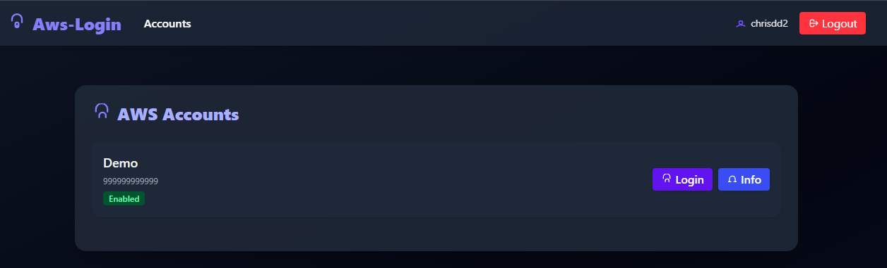
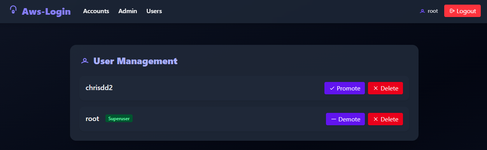

# AWS Login

A modern web application to simplify AWS account access management through GitHub authentication. AWS Login allows organizations to securely manage, grant, and audit access to multiple AWS accounts and roles, all from a user-friendly web interface.

---

## Table of Contents
- [Features](#features)
- [Demo](#demo)
- [CloudFormation Templates](#cloudformation-templates)
- [Prerequisites](#prerequisites)
- [Environment Variables](#environment-variables)
- [Installation](#installation)
- [Running the Application](#running-the-application)
- [Usage](#usage)
- [Project Structure](#project-structure)
- [Testing](#testing)
- [Development](#development)
- [Contributing](#contributing)
- [License](#license)
- [Author](#author)

---

## Features

- **GitHub OAuth Authentication**: Secure login via GitHub.
- **AWS Role Management**: Assume different AWS roles (developer, read-only, etc.).
- **Multi-Account Support**: Manage access to multiple AWS accounts.
- **Permission Management**: Fine-grained control over user access to accounts and roles.
- **Web UI**: Modern, responsive interface for managing AWS accounts, users, and permissions.
- **CloudFormation Automation**: Bootstrap and manage AWS IAM roles and permissions via provided templates.
- **Admin Panel**: Superusers can manage users, accounts, and permissions.

---

## Demo

Below are screenshots showcasing the main features and UI of AWS Login:

### Login Page


### Dashboard


### Account Management


### Account Info


### Role Selection


### User Management


### Setup Account (CloudFormation)


---

## CloudFormation Templates

The project provides two CloudFormation templates in `aws/cfn/`:

- **`bootstrap.template`**: Creates an IAM role with `AdministratorAccess` for initial account setup. Used to bootstrap a new AWS account for use with AWS Login.
- **`base.template`**: Sets up IAM roles (Developer, ReadOnly) and a permissions boundary to restrict IAM actions. Used to manage roles and permissions for ongoing access control.
- **`iam-user-policy.template`**: Provides an AWS IAM user policy for the application to assume roles and get caller identity.

You can export and deploy these templates directly from the web UI or via the AWS Console/CLI.

---

## Prerequisites

- Go 1.24+
- A GitHub OAuth application (Client ID and Secret)
- AWS credentials configured locally (for the server to assume roles)
- **An AWS IAM user with the following policy attached:**

  The application requires an AWS user with permission to assume roles and get caller identity. Attach this policy to the user:

  ```json
  {
      "Version": "2012-10-17",
      "Statement": [
          {
              "Sid": "VisualEditor0",
              "Effect": "Allow",
              "Action": [
                  "sts:AssumeRole",
                  "sts:GetCallerIdentity"
              ],
              "Resource": "*"
          }
      ]
  }
  ```

  You can deploy this policy using the provided CloudFormation template (`aws/cfn/iam-user-policy.template`).

  **To deploy with AWS CLI:**

  ```sh
  aws cloudformation deploy \
    --template-file aws/cfn/iam-user-policy.template \
    --stack-name aws-login-iam-policy \
    --parameter-overrides UserName=YOUR_IAM_USERNAME \
    --capabilities CAPABILITY_NAMED_IAM
  ```

  Replace `YOUR_IAM_USERNAME` with the name of your IAM user.

---

## Environment Variables

| Variable                  | Description                              | Default           |
|---------------------------|------------------------------------------|-------------------|
| `APP_LISTEN_ADDR`         | Address and port to listen on            | `0.0.0.0:8080`    |
| `APP_STORE_FILE`          | Path to the storage file                 | `store.json`      |
| `APP_GENERATE_TOKEN`      | Set to any value to generate admin token | -                 |
| `APP_SIGN_KEY`            | Key to use for signing tokens            | **Required**      |
| `APP_CLIENT_ID`           | GitHub OAuth client ID                   | **Required**      |
| `APP_CLIENT_SECRET`       | GitHub OAuth client secret               | **Required**      |
| `APP_DATABASE_URL`        | (Optional) Postgres DSN for SQL storage  | -                 |

**Note:**
- If `APP_DATABASE_URL` is set, the application will use a PostgreSQL database for storage and auto-create tables if needed.
- Otherwise the application will use the default in-memory (JSON file) storage backend.

**Example DSN:**
```
APP_DATABASE_URL=postgres://postgres:postgres@db:5432/postgres?sslmode=disable
```

---

## Installation

1. **Clone the repository:**
   ```sh
   git clone https://github.com/chrisdd2/aws-login.git
   cd aws-login
   ```
2. **Install dependencies:**
   ```sh
   go mod download
   ```
3. **Build the application:**
   ```sh
   go build -o aws-login
   ```

---

## Running the Application

1. **Set the required environment variables:**
   ```sh
   export APP_CLIENT_ID=your_github_client_id
   export APP_CLIENT_SECRET=your_github_client_secret
   export APP_SIGN_KEY=your_signing_key
   # Optionally, to use SQL storage:
   export APP_DATABASE_URL=postgres://postgres:postgres@db:5432/postgres?sslmode=disable
   # the callback url should point to /oauth2/idpresponse e.g http://localhost:8080/oauth2/idpresponse
   # Optionally set AWS credentials and other variables
   ```
2. **Run the application:**
   ```sh
   ./aws-login
   ```
   Or use the development script (with hot reload):
   ```sh
   ./dev.sh
   ```
3. **Access the web interface:**
   - Open [http://localhost:8080](http://localhost:8080) in your browser.

---

## Usage

1. **Login**: Authenticate using your GitHub account.
2. **Account Management**: Add AWS accounts, set friendly names, enable/disable, and tag them.
3. **Role Selection**: Choose which role to assume for each account (Developer, ReadOnly, etc.).
4. **Console Access**: Click on the generated links to access the AWS Console with the assumed role, or download temporary credentials.
5. **User Management**: Superusers can promote/demote users, grant/revoke permissions, and manage all accounts.
6. **CloudFormation**: Use the UI to bootstrap new AWS accounts or update roles using the provided templates.

---

## Project Structure

- `/auth`         : Authentication mechanisms (GitHub OAuth, JWT)
- `/aws`          : AWS-related functionality (role assumption, CloudFormation, console URL generation)
- `/aws/cfn`      : CloudFormation templates for bootstrapping and role setup
- `/storage`      : Data persistence layer (in-memory, JSON-backed)
- `/webui`        : Web interface and API endpoints
- `/webui/templates`: HTML templates for the web UI (Tailwind CSS)
- `main.go`       : Application entry point
- `dev.sh`        : Development script for local running
- `store.json`    : Example data store (users, accounts, permissions)

---

## Testing

Unit tests are provided for core logic:

- To run all tests:
  ```sh
  go test ./...
  ```
- Example test files:
  - `aws/aws_test.go`: Tests AWS ARN parsing logic.
  - `storage/memory_test.go`: Tests in-memory storage and permission logic.

---

## Development

- Uses Go modules for dependency management.
- To add new dependencies:
  ```sh
  go get github.com/example/package
  ```
- The UI is built with Tailwind CSS and rendered server-side using Go templates.
- Hot reload is supported in development mode via `gow` (see `dev.sh`).

---

## Contributing

Contributions are welcome! To contribute:

1. Fork the repository
2. Create a new branch (`git checkout -b feature/your-feature`)
3. Commit your changes
4. Push to your fork and open a Pull Request

For major changes, please open an issue first to discuss what you would like to change.

---

## License

This project is licensed under the MIT License. You are free to use, modify, and distribute it for any purpose, including commercial use, as long as the original copyright and license notice are included.

See [LICENSE](./LICENSE) for details.

---

## Author

[chrisdd2](https://github.com/chrisdd2)
